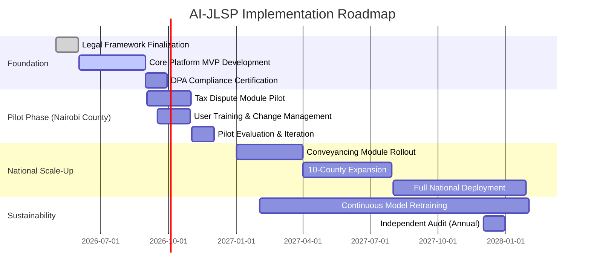

# TECHNICAL REQUIREMENTS DOCUMENT (TRD)

## AI-Enhanced Judicial & Legal Services Platform (AI-JLSP)

**Version:** 1.0 | **Classification:** Confidential | **Date:** May 2026

---

## 1. EXECUTIVE SUMMARY

### 1.1 Vision Statement

To revolutionize Kenya's justice administration through an AI-powered platform that streamlines legal operations, enhances decision-making accuracy, accelerates case resolution, and promotes equitable access to justice—all while ensuring strict compliance with the Constitution of Kenya (2010), Data Protection Act (Cap. 411C), and all applicable statutory frameworks.

### 1.2 Strategic Objectives

| Objective            | Target Outcome                                                    | Timeline  |
| -------------------- | ----------------------------------------------------------------- | --------- |
| **Efficiency**       | Reduce case processing time by 60%                                | 24 months |
| **Accuracy**         | Achieve 95%+ accuracy in legal document analysis                  | 18 months |
| **Accessibility**    | Enable 24/7 access to legal services for 80% of citizens          | 36 months |
| **Compliance**       | 100% adherence to Data Protection Act & constitutional safeguards | Ongoing   |
| **Justice Delivery** | Reduce case backlog by 70% in pilot jurisdictions                 | 30 months |

### 1.3 Scope of Application

```
┌─────────────────────────────────────────────────────┐
│ IN SCOPE                                            │
├─────────────────────────────────────────────────────┤
│ • Case intake, triage & assignment automation       │
│ • AI-assisted legal research & precedent analysis   │
│ • Predictive analytics for litigation outcomes      │
│ • Automated document drafting & contract review     │
│ • Tax dispute resolution workflow optimization      │
│ • Board & committee meeting management              │
│ • Conveyancing & property transaction support       │
│ • Compliance monitoring & regulatory alerts         │
│ • Secure data management per Data Protection Act    │
│ • Multi-language support (English, Kiswahili, KSL)  │
├─────────────────────────────────────────────────────┤
│ OUT OF SCOPE                                        │
├─────────────────────────────────────────────────────┤
│ • Replacement of judicial discretion or authority   │
│ • Automated adjudication of criminal matters        │
│ • Processing of classified national security data   │
│ • Direct citizen-to-citizen legal representation    │
└─────────────────────────────────────────────────────┘
```

---

## 2. LEGAL & REGULATORY COMPLIANCE FRAMEWORK

### 2.1 Foundational Legal Anchors

| Legal Instrument                           | Relevance to AI-JLSP                                                                  | Compliance Requirement                                                                  |
| ------------------------------------------ | ------------------------------------------------------------------------------------- | --------------------------------------------------------------------------------------- |
| **Constitution of Kenya, 2010**            | Articles 31 (Privacy), 35 (Access to Info), 47 (Fair Admin Action), 50 (Fair Hearing) | All AI decisions must be explainable, appealable, and non-discriminatory                |
| **Data Protection Act (Cap. 411C)**        | Sections 25-43 (Data Processing Principles)                                           | Lawful basis for processing; data minimization; purpose limitation; security safeguards |
| **Kenya Revenue Authority Act (Cap. 469)** | Sections 5, 11-13 (Functions & Officers)                                              | Platform must support KRA's statutory mandate for revenue administration                |
| **Penal Code (Cap. 63)**                   | Sections 108-121 (Offences relating to justice)                                       | Platform must prevent misuse, fraud, or obstruction of justice                          |
| **Tax Procedures Act (Cap. 469B)**         | Objection & ADR processes                                                             | Must support independent review workflows per Section 51 TPA                            |

### 2.2 AI-Specific Compliance Controls

```yaml
Ethical_AI_Governance:
  human_in_the_loop:
    - All final legal decisions require human officer approval
    - AI recommendations must include confidence scores & rationale
    - Right to human review guaranteed per Article 47, Constitution

  bias_mitigation:
    - Regular algorithmic audits for demographic parity
    - Training data representative of Kenya's 47 counties & diverse communities
    - Bias detection thresholds: <2% disparity across protected classes

  transparency:
    - All AI-generated outputs labeled with "AI-Assisted" watermark
    - Full audit trail of AI decision pathways retained for 7 years
    - Data subjects may request explanation of automated processing (Sec 26, DPA)

  data_sovereignty:
    - All personal data processed & stored within Kenya (Sec 50, DPA)
    - Cross-border transfers require Data Commissioner approval + adequacy safeguards
    - Encryption: AES-256 at rest; TLS 1.3+ in transit
```

### 2.3 Accountability Matrix

| Role                                       | Responsibility                                                | Legal Basis                |
| ------------------------------------------ | ------------------------------------------------------------- | -------------------------- |
| **Data Controller** (e.g., Judiciary, KRA) | Determine purposes & means of processing                      | Sec 2, Data Protection Act |
| **Data Processor** (AI-JLSP Platform)      | Process data per controller instructions; implement security  | Sec 2, 41-42, DPA          |
| **Data Protection Officer**                | Monitor compliance; advise on DPIAs; liaise with Commissioner | Sec 24, DPA                |
| **AI Ethics Committee**                    | Review high-risk AI deployments; approve model updates        | Internal Governance Policy |
| **Judicial Officer**                       | Final authority on case outcomes; override AI recommendations | Article 159, Constitution  |

---

## 3. TECHNICAL ARCHITECTURE

### 3.1 High-Level Architecture Diagram

```
┌─────────────────────────────────────────────────────────────┐
│                    PRESENTATION LAYER                        │
├─────────────────────────────────────────────────────────────┤
│ • Web Portal (React/Next.js) • Mobile App (Flutter)         │
│ • Voice Interface (Kiswahili NLP) • API Gateway (Kong)      │
│ • Accessibility: WCAG 2.1 AA; KSL video support             │
└────────────────┬────────────────────────────────────────────┘
                 │ HTTPS / OAuth 2.0 / MFA
┌────────────────▼────────────────────────────────────────────┐
│                   APPLICATION LAYER                          │
├─────────────────────────────────────────────────────────────┤
│ ┌─────────────┐ ┌─────────────┐ ┌─────────────┐            │
│ │Case Mgmt    │ │Legal Research│ │Doc Automation│            │
│ │Microservice │ │Microservice │ │Microservice │            │
│ └──────┬──────┘ └──────┬──────┘ └──────┬──────┘            │
│        │               │               │                   │
│ ┌──────▼───────────────▼───────────────▼──────┐            │
│ │         AI ORCHESTRATION ENGINE            │            │
│ │ • Model router • Prompt manager • Guardrails│            │
│ │ • Explainability module • Audit logger     │            │
│ └────────────────┬───────────────────────────┘            │
└─────────────────┬─────────────────────────────────────────┘
                  │ gRPC / Async Queue
┌─────────────────▼─────────────────────────────────────────┐
│                    DATA LAYER                              │
├────────────────────────────────────────────────────────────┤
│ • Primary DB: PostgreSQL (structured case data)           │
│ • Vector DB: Pinecone/Milvus (legal precedent embeddings) │
│ • Document Store: MinIO (encrypted PDFs, scans)           │
│ • Cache: Redis (session, rate limiting)                   │
│ • Analytics: Apache Druid (real-time dashboards)          │
└─────────────────┬─────────────────────────────────────────┘
                  │ Secure VPC Peering
┌─────────────────▼─────────────────────────────────────────┐
│                 AI/ML INFRASTRUCTURE                       │
├────────────────────────────────────────────────────────────┤
│ • Model Registry: MLflow (versioning, lineage)            │
│ • Training Cluster: Kubernetes + NVIDIA GPUs              │
│ • Inference: Triton Inference Server (low-latency)        │
│ • Monitoring: Prometheus + Grafana + Evidently AI         │
│ • Model Types:                                            │
│   - Legal-BERT-KE (fine-tuned on Kenyan statutes/cases)   │
│   - Swahili-Legal-NER (named entity recognition)          │
│   - CaseOutcome-Predictor (gradient boosting + SHAP)      │
│   - DocClassifier (multi-label legal document taxonomy)   │
└────────────────────────────────────────────────────────────┘
```

### 3.2 Core AI/ML Capabilities Specification

#### 3.2.1 Legal Document Intelligence Engine

```python
class LegalDocumentProcessor:
    """
    Processes legal instruments per KRA Work Procedures Manual (Sections 6.1.8-6.1.9)
    """
    def __init__(self):
        self.ner_model = load_model("swahili-legal-ner-v2")  # Kenyan entity types
        self.classifier = load_model("doc-type-classifier-ke")
        self.compliance_checker = RuleEngine("kra-conveyancing-rules.yaml")

    def process_contract(self, document: PDF) -> ProcessedDocument:
        # Extract parties, dates, obligations, penalties
        entities = self.ner_model.extract(document.text)

        # Classify: Lease vs. SLA vs. MoU vs. Charge Instrument
        doc_type = self.classifier.predict(document.metadata)

        # Validate against statutory requirements
        compliance_report = self.compliance_checker.validate(
            entities, 
            doc_type,
            reference_laws=["Land Act 2012", "Tax Procedures Act Sec 40"]
        )

        # Generate risk score & recommended clauses
        risk_assessment = self._assess_risk(entities, compliance_report)

        return ProcessedDocument(
            structured_data=entities,
            doc_type=doc_type,
            compliance_status=compliance_report.status,
            risk_score=risk_assessment.score,
            ai_recommendations=risk_assessment.suggestions,
            human_review_required=risk_assessment.score > 0.7
        )
```

#### 3.2.2 Predictive Litigation Analytics Module

| Feature                         | Technical Approach                                                                              | Legal Safeguard                                                                                 |
| ------------------------------- | ----------------------------------------------------------------------------------------------- | ----------------------------------------------------------------------------------------------- |
| **Case Outcome Prediction**     | Ensemble of XGBoost + Legal-BERT embeddings; trained on anonymized historical cases (2010-2025) | Output includes 95% confidence interval; never used for sentencing; requires judicial oversight |
| **Precedent Similarity Search** | Dense vector retrieval (FAISS) + sparse BM25 hybrid; re-ranked by recency & court hierarchy     | Results show source court, date, and full citation; no "black box" ranking                      |
| **Workload Forecasting**        | Prophet time-series + external factors (legislative calendar, economic indicators)              | Used for resource planning only; not for case prioritization                                    |
| **Bias Detection Dashboard**    | Statistical parity, equalized odds metrics across county, gender, language dimensions           | Alerts trigger mandatory model retraining; reports to AI Ethics Committee                       |

#### 3.2.3 Natural Language Interface (Kiswahili-First)

```yaml
NLP_Capabilities:
  supported_languages:
    - English (primary)
    - Kiswahili (primary) 
    - Kenyan Sign Language (video interpretation API)
    - Indigenous languages (phase 2: Kikuyu, Dholuo, Kikamba)

  legal_nlu_features:
    - Statute citation parsing: "Sec 51(3) TPA" → {law: "Tax Procedures Act", section: 51, subsection: 3}
    - Temporal reasoning: "within 14 days of assessment" → deadline calculation
    - Entity resolution: Link "KRA", "Kenya Revenue Authority", "the Authority" → same organization
    - Intent classification: 
        * "file objection" → route to TDR workflow
        * "check case status" → query case management DB
        * "explain penalty" → retrieve relevant provisions + plain-language summary

  accessibility_compliance:
    - Voice input/output with Swahili TTS/STT (Mozilla TTS fine-tuned)
    - Screen reader optimized (ARIA labels, semantic HTML)
    - Low-bandwidth mode: text-only fallback <100KB/page
```

---

## 4. CORE FUNCTIONAL MODULES

### 4.1 Module Taxonomy & Integration Points

```
AI-JLSP Platform
├── 1. INTELLIGENT CASE INTAKE & TRIAGE
│   ├── Auto-classify incoming matters (tax dispute, conveyancing, litigation, board query)
│   ├── Extract key metadata: PIN, assessment date, tax head, amount in dispute
│   ├── Route to appropriate division per KRA Org Structure (Sec 1.1, Work Procedures)
│   └── Flag high-priority cases: imminent deadlines, vulnerable taxpayers, constitutional issues
│
├── 2. AI-ASSISTED LEGAL RESEARCH HUB
│   ├── Semantic search across: Constitution, Acts, Regulations, Case Law, KRA Guidelines
│   ├── "Explain this provision" feature: plain-language summaries + contextual examples
│   ├── Precedent analyzer: "How have courts interpreted Sec 51(3) TPA in similar facts?"
│   └── Citation validator: auto-check if cited provisions are still in force (repeals/amendments)
│
├── 3. DOCUMENT AUTOMATION STUDIO
│   ├── Template library: Objection Decisions, ADR Agreements, Conveyancing Instruments
│   ├── Smart clause suggestion: "Based on similar cases, consider adding force majeure clause"
│   ├── Compliance pre-check: Validate drafts against Land Registration Act, TPA, etc.
│   └── Version control with audit trail: Who changed what, when, and why
│
├── 4. TAX DISPUTE RESOLUTION ACCELERATOR
│   ├── Objection validity checker: Auto-verify Sec 51(3) TPA requirements met
│   ├── ADR suitability assessor: Apply CRF criteria (Work Procedures Sec 15.1-15.2)
│   ├── Settlement scenario modeling: "If taxpayer pays 70% now, projected revenue impact = X"
│   └── Timeline manager: Auto-calculate statutory deadlines; alert on approaching limits
│
├── 5. BOARD & GOVERNANCE SUPPORT SUITE
│   ├── Agenda optimizer: Cluster related items; flag conflicts of interest (Sec 9, KRA Act)
│   ├── Minute drafting assistant: Convert meeting audio → structured minutes + action items
│   ├── Resolution tracker: Monitor implementation of Board decisions across divisions
│   └── Compliance dashboard: Track KPIs per Performance Contracts (Sec 1.1, Work Procedures)
│
├── 6. CONVEYANCING & PROPERTY TRANSACTION MANAGER
│   ├── Title verification workflow: Integrate with Ardhi Sasa (Ministry of Lands API)
│   ├── Charge registration assistant: Auto-generate Sec 40(1) TPA charge instruments
│   ├── Distress order planner: Map taxpayer assets → enforcement options per Auctioneers Act
│   └── Risk scoring: Flag transactions with PEPs, complex ownership, or cross-border elements
│
└── 7. KNOWLEDGE & CAPACITY BUILDING PORTAL
    ├── Personalized learning paths: "You handle VAT objections → recommended modules: X, Y, Z"
    ├── Simulation sandbox: Practice drafting decisions with AI feedback (no real data)
    ├── Peer benchmarking: Anonymous comparison of processing times, quality scores
    └── Regulatory update feed: Auto-summarize new Acts, Regulations, Gazette Notices
```

### 4.2 Critical Workflow: Tax Objection Processing (Sec 51, TPA)

```mermaid
graph LR
    A[Taxpayer Files Objection via iTax/Physical] --> B[AI-JLSP Intake Engine]
    B --> C{Validity Check: Sec 51(3) TPA}
    C -->|❌ Invalid| D[Auto-generate Invalidation Notice<br/>with specific deficiency + cure instructions]
    C -->|✅ Valid| E[Assign to IRO Officer + Case Complexity Score]
    E --> F[AI Research Assistant:<br/>- Retrieve ACS, SPR, assessments<br/>- Suggest relevant precedents<br/>- Flag procedural gaps]
    F --> G[Officer Drafts ORS with AI suggestions]
    G --> H[ORC Review: AI highlights key facts, legal issues, options]
    H --> I[Objection Decision Issued ≤60 days]
    I --> J[Auto-notify parties + update iTax + archive per Records Mgmt Policy]
    J --> K{Taxpayer Satisfied?}
    K -->|No| L[AI suggests ADR suitability + generates application draft]
    K -->|Yes| M[Case Closed + Revenue Released]
```

---

## 5. DATA MANAGEMENT & SECURITY

### 5.1 Data Classification & Handling Protocol

| Data Category        | Examples                                  | Classification         | Retention                    | Encryption                              | Access Control                                            |
| -------------------- | ----------------------------------------- | ---------------------- | ---------------------------- | --------------------------------------- | --------------------------------------------------------- |
| **Personal Data**    | PIN, name, contact, financial details     | Sensitive (Sec 2, DPA) | 7 years post-case closure    | AES-256 + field-level masking           | RBAC + attribute-based (county, division, case role)      |
| **Case Records**     | Pleadings, decisions, evidence            | Confidential           | Permanent (judicial records) | AES-256 + immutable audit log           | Need-to-know + judicial authorization for sensitive cases |
| **AI Training Data** | Anonymized historical cases               | Internal Use           | 5 years (retraining cycle)   | Tokenization + k-anonymity (k=50)       | Data Science Team + Ethics Committee approval             |
| **System Logs**      | API calls, model inferences, user actions | Operational            | 2 years (security audits)    | HMAC-SHA256 integrity checks            | SOC team + automated anomaly detection                    |
| **Board Documents**  | Minutes, resolutions, strategic plans     | Restricted             | Permanent + archival         | End-to-end encrypted; air-gapped backup | Board Secretary + designated officers only                |

### 5.2 Data Protection Impact Assessment (DPIA) Triggers

Per Section 31, Data Protection Act, a DPIA is mandatory when:

- [x] Processing involves **sensitive personal data** (health, financial, biometric)
- [x] Using **automated decision-making** with legal/significant effects (Sec 35, DPA)
- [x] **Systematic monitoring** of publicly accessible areas (e.g., court recording analysis)
- [x] **Large-scale processing** of data relating to criminal convictions (Penal Code matters)
- [x] **Innovative use of new technologies** (generative AI for legal drafting)

**DPIA Process Flow:**

```
1. Project Initiation → 2. Describe Processing → 3. Assess Necessity/Proportionality  
→ 4. Identify Risks to Rights/Freedoms → 5. Propose Mitigations  
→ 6. Consult Data Commissioner (if high risk) → 7. Approve & Implement  
→ 8. Continuous Monitoring & Review (quarterly)
```

### 5.3 Security Architecture Controls

```yaml
Infrastructure_Security:
  network:
    - Zero-trust architecture: micro-segmentation, service mesh (Istio)
    - WAF + DDoS protection (Cloudflare Enterprise)
    - Private endpoints for all data services; no public internet exposure

  identity:
    - MFA mandatory for all users (TOTP + biometric fallback)
    - Just-in-time privileged access (HashiCorp Vault)
    - Session management: 15-min idle timeout; concurrent login alerts

  data_protection:
    - Encryption: AES-256-GCM at rest; TLS 1.3+ in transit
    - Key management: HSM-backed (AWS CloudHSM or on-prem Thales)
    - Data loss prevention: Context-aware rules block exfiltration of PINs, case IDs

  ai_specific:
    - Model watermarking: Cryptographic signatures on all AI outputs
    - Prompt injection defense: Input sanitization + output validation layers
    - Adversarial testing: Red team exercises quarterly (OWASP ML Top 10)

  audit_compliance:
    - Immutable audit logs: Write-once storage; cryptographically chained
    - Real-time SIEM: Splunk ES with Kenya-specific threat intel feeds
    - Automated compliance checks: Scan configs against DPA, Constitution, ISO 27001
```

---

## 6. INTEGRATION REQUIREMENTS

### 6.1 Critical External System Integrations

| System                      | Purpose                                          | Integration Method                | Data Flow                      | Compliance Note                                            |
| --------------------------- | ------------------------------------------------ | --------------------------------- | ------------------------------ | ---------------------------------------------------------- |
| **iTax (KRA)**              | Receive objections, assessments, taxpayer data   | REST API (OAuth 2.0)              | Bi-directional (read/write)    | Sec 28-29, DPA: Purpose limitation; data minimization      |
| **eCitizen**                | Citizen authentication, service requests         | Government Service Bus (GSB)      | Inbound requests only          | Article 35, Constitution: Access to information safeguards |
| **Ardhi Sasa (Lands)**      | Property title verification, charge registration | Ministry of Lands API (SOAP/REST) | Outbound queries only          | Land Act 2012: Authorized access only                      |
| **TAT Case Management**     | Appeal tracking, hearing schedules               | Secure File Transfer + Webhooks   | Bi-directional (case status)   | Tax Appeals Tribunal Act: Confidentiality of proceedings   |
| **National Treasury IFMIS** | Revenue reconciliation, payment tracking         | ISO 20022 messaging               | Outbound payment confirmations | Public Finance Management Act: Audit trail integrity       |
| **Kenya Law (eKLR)**        | Case law, statutes, subsidiary legislation       | Public API + scheduled sync       | Inbound reference data only    | Copyright considerations; fair use for legal research      |

### 6.2 API Design Principles

```yaml
API_Governance:
  versioning: Semantic versioning (v1, v2); deprecation policy: 12-month notice
  authentication: OAuth 2.0 + JWT; short-lived tokens (15 min); refresh token rotation
  rate_limiting: Tiered by user role (citizen: 10/min; officer: 100/min; system: 1000/min)
  documentation: OpenAPI 3.1 + interactive sandbox; Kiswahili/English toggle
  error_handling: Standardized error codes; no stack traces in responses; user-friendly messages

  sample_endpoint:
    POST /api/v1/cases/objections/validate
    Request:
      {
        "pin": "A001234567X",
        "assessment_id": "ASMT-2026-00451",
        "objection_grounds": "Dispute on valuation methodology per Sec 22, Valuation for Rating Act",
        "supporting_docs": ["doc_hash_abc123", "doc_hash_def456"]
      }
    Response (200):
      {
        "validity_status": "VALID",
        "compliance_checks": {
          "sec_51_3a": {"met": true, "notes": "Grounds precisely stated"},
          "sec_51_3b": {"met": true, "notes": "Undisputed tax paid: KES 150,000"},
          "sec_51_3c": {"met": true, "notes": "2/2 required docs submitted"}
        },
        "next_steps": [
          "Assign to IRO Officer (estimated wait: 2.3 days)",
          "Prepare ORS template (auto-populated with case metadata)"
        ],
        "ai_confidence": 0.94,
        "human_review_required": false
      }
```

---

## 7. USER EXPERIENCE & ACCESSIBILITY

### 7.1 Persona-Based Design Requirements

| User Persona                      | Key Needs                                                             | Accessibility Requirements                                                                    |
| --------------------------------- | --------------------------------------------------------------------- | --------------------------------------------------------------------------------------------- |
| **Taxpayer (Citizen)**            | Simple objection filing; status tracking; plain-language explanations | WCAG 2.1 AA; Kiswahili first; voice navigation; low-literacy mode                             |
| **Legal Officer (KRA/Judiciary)** | Efficient case management; research support; compliance alerts        | Keyboard navigation; screen reader optimized; customizable dashboards                         |
| **Board Member**                  | Strategic oversight; performance analytics; secure document access    | Executive summary views; mobile-responsive; secure offline access                             |
| **Person with Disability**        | Full platform access regardless of ability                            | KSL video interpretation; high-contrast mode; switch device support; cognitive load reduction |
| **Rural User (Low Connectivity)** | Offline capability; SMS/USSD fallback; minimal data usage             | Progressive Web App (PWA); <50KB critical path; SMS command interface                         |

### 7.2 Inclusive Design Implementation

```css
/* Example: Accessible Case Status Component */
.case-status-card {
  /* High contrast mode support */
  @media (prefers-contrast: high) {
    background: #000; color: #FFD700; border: 3px solid #FFF;
  }

  /* Reduced motion for vestibular disorders */
  @media (prefers-reduced-motion: reduce) {
    animation: none !important;
    transition: none !important;
  }

  /* Screen reader optimization */
  .status-badge::after {
    content: attr(aria-label); /* e.g., "Status: Under Review - Expected decision in 14 days" */
    position: absolute;
    left: -9999px;
  }

  /* Keyboard focus visibility */
  :focus-visible {
    outline: 3px solid #0056b3;
    outline-offset: 2px;
  }
}

/* Kiswahili-first content strategy */
.content-language {
  /* Default to Kiswahili; allow toggle */
  lang: "sw";

  /* Legal term glossary tooltip */
  .legal-term[data-term="objection"] {
    cursor: help;
    border-bottom: 1px dotted currentColor;
  }
  .legal-term[data-term="objection"]::after {
    content: attr(data-definition-sw); /* "Maombi ya kukataa uamuzi wa Mkombozi" */
    /* ... tooltip styling ... */
  }
}
```

---

## 8. PERFORMANCE, SCALABILITY & RELIABILITY

### 8.1 Service Level Objectives (SLOs)

| Metric                    | Target                        | Measurement                | Alert Threshold  |
| ------------------------- | ----------------------------- | -------------------------- | ---------------- |
| **API Latency (p95)**     | <800ms                        | Synthetic monitoring + RUM | >1.5s for 5 min  |
| **AI Inference Time**     | <2s (simple), <10s (complex)  | Model server metrics       | >2x baseline     |
| **System Availability**   | 99.95% (business hours)       | Uptime monitoring          | <99.5% hourly    |
| **Data Sync Latency**     | <5 min (iTax ↔ AI-JLSP)       | End-to-end tracing         | >15 min          |
| **Error Rate**            | <0.1% (user-facing)           | Structured logging         | >0.5% for 10 min |
| **Model Drift Detection** | <24h from concept drift onset | Evidently AI monitors      | Drift score >0.3 |

### 8.2 Scalability Strategy

```yaml
Horizontal_Scaling:
  stateless_services:
    - Auto-scaling groups: Min 3, Max 50 instances per service
    - Scaling triggers: CPU >70%, Request queue >100, Latency p95 >1s

  data_layer:
    - PostgreSQL: Read replicas (3x) + logical sharding by county code
    - Vector DB: Distributed index; shard by legal domain (tax, land, criminal)
    - Cache: Redis Cluster with automatic failover

  ai_inference:
    - Model parallelism: Split large models across GPUs
    - Request batching: Dynamic batch sizing (1-32) based on load
    - Fallback models: Lightweight "fast mode" models during peak load

Disaster_Recovery:
  rpo: <5 minutes (transactional data); <1 hour (AI models)
  rto: <30 minutes for critical services; <4 hours full platform
  backup_strategy:
    - Real-time replication to secondary AZ
    - Daily encrypted snapshots to offline, air-gapped storage
    - Quarterly DR drills with full failover simulation
```

---

## 9. TESTING & QUALITY ASSURANCE

### 9.1 Multi-Layered Testing Strategy

```
┌─────────────────────────────────────────┐
│ TESTING PYRAMID                         │
├─────────────────────────────────────────┤
│ 70% Unit Tests                          │
│ • Pure functions: document parsers,     │
│   rule engines, data validators         │
│ • Mock external dependencies            │
│ • Coverage target: 90%+                 │
├─────────────────────────────────────────┤
│ 20% Integration Tests                   │
│ • API contract tests (Pact)             │
│ • Database migration tests              │
│ • AI model input/output validation      │
│ • End-to-end workflow tests (Cypress)   │
├─────────────────────────────────────────┤
│ 10% Non-Functional Tests                │
│ • Load testing: 10x peak traffic (k6)   │
│ • Security testing: SAST/DAST + pentest│
│ • Accessibility testing: axe-core + manual audit │
│ • Bias testing: Disaggregated metrics by county/gender │
└─────────────────────────────────────────┘
```

### 9.2 AI-Specific Validation Framework

```python
def validate_legal_ai_model(model, test_suite):
    """
    Comprehensive validation per AI Ethics Guidelines
    """
    results = {}

    # 1. Functional Accuracy
    results['accuracy'] = evaluate_on_gold_standard(
        model, 
        test_suite['legal_qa_benchmark_ke']  # 500 Kenyan legal Q&A pairs
    )

    # 2. Fairness & Bias Assessment
    results['fairness'] = assess_demographic_parity(
        model,
        test_suite['diverse_cases'],  # Cases balanced by county, gender, language
        protected_attributes=['county', 'gender', 'language_preference']
    )

    # 3. Robustness Testing
    results['robustness'] = {
        'adversarial': test_adversarial_examples(model, test_suite['adversarial_set']),
        'out_of_distribution': test_ood_detection(model, test_suite['ood_cases']),
        'prompt_injection': test_prompt_safety(model, test_suite['jailbreak_attempts'])
    }

    # 4. Explainability Quality
    results['explainability'] = evaluate_rationale_quality(
        model.generate_explanation,
        test_suite['explanation_gold_standard'],
        criteria=['legally_sound', 'complete', 'understandable']
    )

    # 5. Compliance Check
    results['compliance'] = {
        'dpa_principles': verify_data_processing_compliance(model, 'DPA_2019'),
        'constitutional_alignment': check_against_bill_of_rights(model, 'Constitution_2010'),
        'audit_trail': validate_logging_completeness(model.inference_log_schema)
    }

    # Gate: Model deployment requires ALL thresholds met
    deployment_approved = all([
        results['accuracy'] >= 0.92,
        results['fairness']['max_disparity'] <= 0.02,
        results['robustness']['prompt_injection']['blocked'] >= 0.99,
        results['compliance']['dpa_principles']['passed']
    ])

    return ModelValidationReport(
        results=results,
        deployment_approved=deployment_approved,
        recommendations=generate_improvement_suggestions(results),
        ethics_committee_review_required=not deployment_approved
    )
```

---

## 10. DEPLOYMENT, MAINTENANCE & GOVERNANCE

### 10.1 Phased Rollout Strategy



### 10.2 Operational Governance Structure

```
AI-JLSP Governance Council
├── Chair: Chief Justice / Cabinet Secretary (rotating)
├── Members:
│   ├── Data Commissioner (or representative)
│   ├── Director of Public Prosecutions
│   ├── KRA Commissioner-General
│   ├── Law Society of Kenya representative
│   ├── Civil Society (digital rights, disability inclusion)
│   ├── Technical Expert (AI ethics, cybersecurity)
│   └── Citizen Representative (via public nomination)
│
├── Sub-Committees:
│   ├── Ethics & Compliance: Review high-risk AI deployments; approve model updates
│   ├── Technical Oversight: Architecture reviews; security audits; performance monitoring
│   ├── User Experience: Accessibility testing; feedback integration; training programs
│   └── Impact Assessment: Measure justice delivery outcomes; equity analysis
│
├── Decision Rights:
│   • Model deployment: Requires Ethics Committee approval + Council notification
│   • Data sharing agreements: Council approval + DPA registration
│   • Major architecture changes: Technical Oversight sign-off + Council briefing
│   • Incident response: Escalation protocol with 24h Council notification for critical events
│
└── Transparency Mechanisms:
    • Public dashboard: System performance, case throughput, bias metrics (anonymized)
    • Quarterly public reports: Impact on justice delivery, lessons learned
    • Citizen feedback portal: Structured input on platform experience
    • Annual independent audit: Published summary (redacted for security)
```

---

## 11. RISK MANAGEMENT & MITIGATION

### 11.1 Risk Register (Top 10)

| Risk                                                | Likelihood | Impact   | Mitigation Strategy                                                                                                                                                                 | Owner                          |
| --------------------------------------------------- | ---------- | -------- | ----------------------------------------------------------------------------------------------------------------------------------------------------------------------------------- | ------------------------------ |
| **AI bias leading to unfair outcomes**              | Medium     | Critical | • Mandatory bias testing pre-deployment<br>• Human-in-the-loop for high-stakes decisions<br>• Regular fairness audits + public reporting                                            | AI Ethics Committee            |
| **Data breach of sensitive taxpayer/judicial data** | Low        | Critical | • Zero-trust architecture + encryption<br>• Continuous security monitoring + pentesting<br>• Incident response plan with 1h containment SLA                                         | CISO / Data Protection Officer |
| **Over-reliance on AI eroding legal expertise**     | Medium     | High     | • Platform designed as "assistant", not replacement<br>• Mandatory training on AI limitations<br>• Performance metrics include human judgment quality                               | Training Directorate           |
| **System outage during critical deadlines**         | Medium     | High     | • Multi-AZ deployment + automated failover<br>• Offline mode for critical workflows<br>• Statutory deadline buffer alerts (72h advance warning)                                     | Platform Engineering           |
| **Non-compliance with Data Protection Act**         | Medium     | High     | • Privacy by design: DPIA for all features<br>• Automated compliance checks in CI/CD<br>• DPO embedded in product teams                                                             | Data Protection Officer        |
| **Misinterpretation of Kiswahili legal terms**      | High       | Medium   | • Human-reviewed Swahili legal NLP training data<br>• "Confidence threshold" routing to human for low-confidence interpretations<br>• Continuous feedback loop with legal linguists | NLP Team / Law Society         |
| **Resistance from legal professionals**             | High       | Medium   | • Co-design workshops with judges, advocates, officers<br>• Demonstrate time savings on administrative tasks<br>• Preserve professional discretion in final decisions               | Change Management Lead         |
| **Model drift due to legal changes**                | Medium     | Medium   | • Automated monitoring of legislative updates<br>• Trigger retraining when new Acts/Regulations gazetted<br>• Versioned models with rollback capability                             | MLOps Team                     |
| **Digital exclusion of rural/low-literacy users**   | High       | Medium   | • USSD/SMS fallback for core functions<br>• Community agent network for assisted access<br>• Voice-first interface with Kiswahili TTS                                               | UX Research / Inclusion Team   |
| **Reputational damage from AI error**               | Low        | High     | • Clear "AI-Assisted" labeling on all outputs<br>• Rapid correction protocol with public transparency<br>• Insurance coverage for AI-related liabilities                            | Communications / Legal         |

### 11.2 Incident Response Protocol (AI-Specific)

```
AI Incident Classification:
├── Level 1 (Critical): 
│   • Biased output affecting protected class
│   • Unauthorized data access via AI interface
│   • Model generating legally invalid advice
│   → Response: Immediate model rollback; 1h containment; 24h public notification

├── Level 2 (High):
│   • Performance degradation >50% baseline
│   • Explainability failure (cannot justify output)
│   • Compliance check failure in production
│   → Response: 4h investigation; 24h mitigation plan; 72h resolution target

├── Level 3 (Medium):
│   • User-reported confusion with AI output
│   • Minor bias metric threshold breach
│   • Non-critical integration failure
│   → Response: 24h triage; 72h fix; include in next sprint

Post-Incident Requirements:
1. Root cause analysis within 5 business days
2. Update risk register & mitigation controls
3. If Level 1/2: Report to Data Commissioner per Sec 43, DPA
4. Publish anonymized lessons learned (quarterly transparency report)
```

---

## 12. SUCCESS METRICS & CONTINUOUS IMPROVEMENT

### 12.1 Key Performance Indicators (KPIs)

| Category             | Metric                                                      | Baseline | Target (Y3)         | Measurement Method                          |
| -------------------- | ----------------------------------------------------------- | -------- | ------------------- | ------------------------------------------- |
| **Justice Delivery** | Avg. time to resolve tax objection                          | 120 days | ≤45 days            | Case management system analytics            |
| **Efficiency**       | Officer time saved per case                                 | 0 hrs    | 3.2 hrs             | Time-motion studies + system logs           |
| **Quality**          | Decision accuracy (vs. expert review)                       | N/A      | ≥95%                | Blind review panel sampling                 |
| **Equity**           | Disparity in resolution time (top vs. bottom county decile) | 45 days  | ≤10 days            | Disaggregated performance dashboards        |
| **Accessibility**    | Platform usage by persons with disabilities                 | <1%      | ≥8%                 | Accessibility audit + user analytics        |
| **Trust**            | User confidence in AI recommendations (survey)              | N/A      | ≥4.2/5.0            | Quarterly user experience surveys           |
| **Compliance**       | DPA compliance audit findings                               | N/A      | 0 critical findings | Independent audit reports                   |
| **Innovation**       | New legal insights generated by AI research                 | 0        | 12/year             | Citation analysis of AI-surfaced precedents |

### 12.2 Feedback Loops & Iteration Mechanisms

```
Continuous Improvement Cycle:
1. COLLECT
   • In-app feedback: "Was this AI suggestion helpful?" (1-click)
   • Officer annotations: Flag incorrect/unclear AI outputs
   • Citizen surveys: Post-interaction experience (SMS/USSD)
   • System telemetry: Usage patterns, error rates, performance

2. ANALYZE
   • Monthly: AI Ethics Committee review of bias metrics
   • Quarterly: User experience deep-dive with diverse focus groups
   • Bi-annual: Independent impact assessment (justice outcomes)

3. ADAPT
   • Model retraining: Triggered by performance drift or legal changes
   • UX refinements: Prioritized via user feedback scoring
   • Policy updates: Governance Council approves framework adjustments

4. COMMUNICATE
   • Release notes: Plain-language summaries of improvements
   • Transparency reports: Public dashboard updates (anonymized)
   • Training updates: New modules based on emerging needs
```

---

## 13. APPENDICES

### Appendix A: Glossary of Key Terms

| Term                   | Definition                                                             | Legal Reference            |
| ---------------------- | ---------------------------------------------------------------------- | -------------------------- |
| **Data Subject**       | Identified or identifiable natural person whose data is processed      | Sec 2, Data Protection Act |
| **Automated Decision** | Decision based solely on automated processing producing legal effects  | Sec 35, DPA                |
| **Lawful Basis**       | Condition permitting data processing (consent, legal obligation, etc.) | Sec 30, DPA                |
| **Explainability**     | Ability to understand and trust AI decision rationale                  | Article 47, Constitution   |
| **Human-in-the-Loop**  | Requirement for human review/override of AI outputs                    | AI Ethics Policy Sec 4.2   |

### Appendix B: Compliance Checklist (Pre-Deployment)

- [ ] DPIA completed & approved by Data Commissioner (if high-risk)
- [ ] Model validation report signed by AI Ethics Committee
- [ ] Accessibility audit passed (WCAG 2.1 AA + KSL support)
- [ ] Security penetration test completed; critical findings resolved
- [ ] User training materials developed in English & Kiswahili
- [ ] Incident response plan tested via tabletop exercise
- [ ] Public communication plan approved (transparency commitments)
- [ ] Fallback manual processes documented for system outage scenarios

### Appendix C: Stakeholder Engagement Plan

| Stakeholder Group          | Engagement Method                              | Frequency   | Key Messages                                              |
| -------------------------- | ---------------------------------------------- | ----------- | --------------------------------------------------------- |
| **Judiciary**              | Co-design workshops; judicial advisory panel   | Monthly     | "AI augments, doesn't replace, judicial discretion"       |
| **Legal Practitioners**    | LSK forums; pilot user groups                  | Quarterly   | "Save time on research/admin; focus on advocacy"          |
| **Citizens/Civil Society** | Public consultations; radio forums (Kiswahili) | Bi-annual   | "Faster, fairer access to justice; your rights protected" |
| **Data Commissioner**      | Formal consultations; compliance reviews       | As required | "Privacy by design; proactive DPA adherence"              |
| **Technical Teams**        | Hackathons; open API documentation             | Ongoing     | "Build on our platform; innovate for Kenyan context"      |

---

> **Document Approval**  
> Prepared By: AI-JLSP Technical Architecture Team  
> Reviewed By: Office of the Data Commissioner, Judiciary of Kenya, KRA Legal Services  
> Approved By: AI-JLSP Governance Council  
> Next Review Date: November 2026 (or upon major legal/technical change)  

*This TRD is a living document. All implementations must reference the latest approved version and maintain full traceability to constitutional and statutory requirements.* 🇰🇪⚖️🤖
